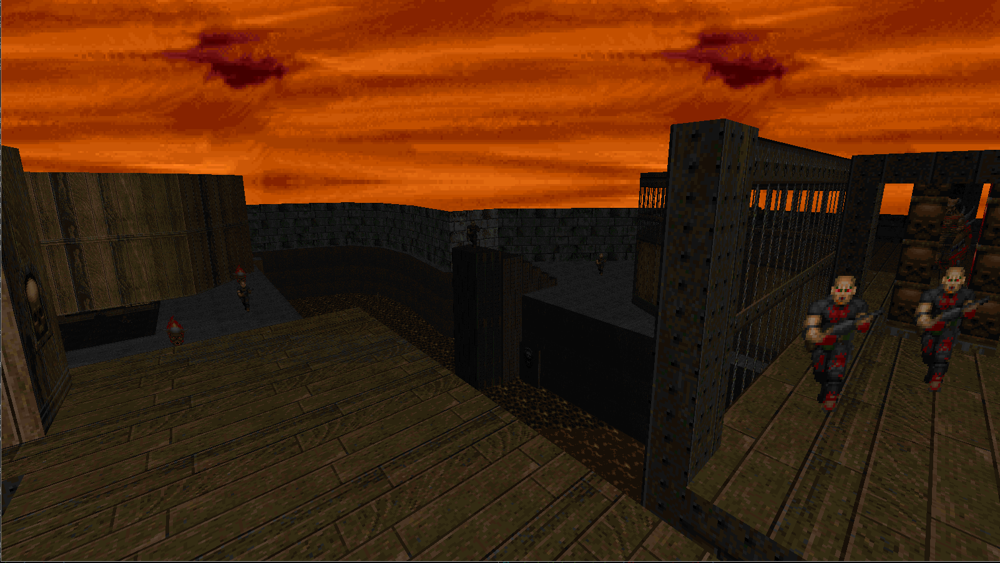
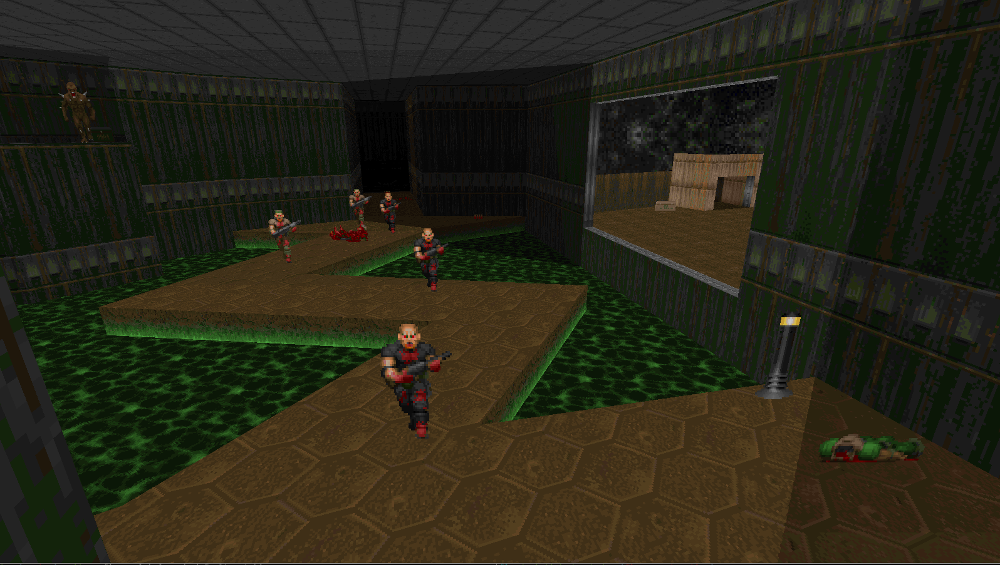

Rust Doom
=========

A little Doom 1 & 2 Renderer written in [Rust](https://github.com/rust-lang/rust). I wanted to learn the language and was inspired by Notch's [Dart Doom renderer](https://github.com/xNotch/Dark), who is using his project to learn Dart better. Mostly it's a fun little project, but I will take PR-s to do with compatibility issues and the like.

The code is mostly based on the endlessly useful [Doom Wiki](http://doomwiki.org) and the [Unofficial Doom Specs](http://aiforge.net/test/wadview/dmspec16.txt). It is **not** a port of the original Doom C source code into Rust; I'm doing my best to make the code as idiomatic as possible and have not even looked at the original in a long time.

## Screenshots



### Build Instructions
I build against nightlies; I pull rustc every few days or so. Give me a shout (submit an issue) if it doesn't build on the most recent nightly and I'll fix it ASAP.

Currently the only non-rust dependency is SDL2. You can install it your system's package manager:

* _Ubuntu/Debian_: ```sudo apt-get install libsdl2-dev```
* _Mac OS_: ```brew install sdl2```

Then, to build, run [cargo](http://crates.io) in the project's root (where Cargo.toml is):
```
cargo build --release
```

Note that you'll need a WAD file (which contains the game's levels and art assets). If you own the game (or are willing to buy it for a few quid/bucks), you'll find it in your game files. If not, you can probably find the shareware ones floating around on the interwebs. Alternatively you can use the [Freedoom](http://freedoom.github.io/download.html) wads, or, though I would not know of such things, you may be able to obtain them for free in less.... savoury parts of the internet.

Copy the WAD file to the repo root (where Cargo.toml is). Then, to run:
```
target/release/rs-doom --iwad your_wad_file.wad
```

Without any flags it will try to load the first level of 'doom1.wad'. You can
specify which level to load, FOV and resolution preferences using the flags. Run
with '-h' for a list of options.

## Goals
_(subject to change)_

* **Modern OpenGL 3 renderer.** No immediate mode shenanigans: it's all VBO-s and shaders. Unlike some GL ports, the floors are actually rendered as convex polygons computed from the BSP. The downside of this (or upside depending on your perspective) is that some visual glitches (like [slime trails](http://doom.wikia.com/wiki/Slime_trail)) don't show up.
* **Correct 256 color palette.** Uses the original palette and colormaps to replicate the original lighting effects (mostly you'll notice things get darker in visible steps and they also get greyer as they get darker). Doing 256 color palette lookups in a fragment shader is wonderfully anachronistic.
* **Free flying camera.** Mouse & keyboard control for full 6 degrees of freedom.

## Todo
* [x] BSP -> convex subsector conversion.
* [x] Flats (floors & ceiling) texture mapping.
* [x] Wall texture mapping.
* [x] Wall texture alignment.
* [x] Scrolling walls.
* [x] Animated flats.
* [x] Animated walls.
* [x] Lighting effects (flickering, flashing, glow etc.)
* [x] Sky rendering.
* [ ] BSP frustum culling.
* [ ] Sprite rendering.
* [ ] Camera-world collisions.
* [ ] Correct player movement (falling etc.)
* [ ] Sprite-player and sprite-sprite collisions.
